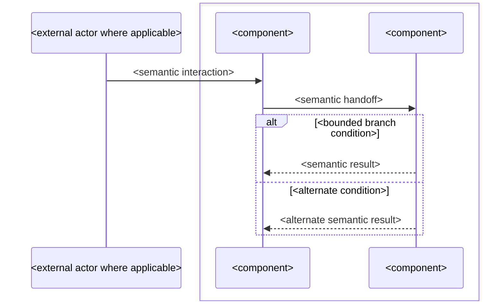

<!--
COMPLETION_CHECKLIST — mark each section included or not_applicable before committing:

  preconditions: included | not_applicable
  asynchronous_work: included | not_applicable

  retry_and_recovery: included | not_applicable
  state_boundary: included | not_applicable
-->

# `<workflow>`

## Scope

<!--
Litmus test:
Where does this workflow begin, where does it end, and what outcome causes
it to stop?
-->

This workflow begins when <initiating event, request, notification, or established state>.

It ends when <successful terminal condition>, or when <bounded refusal or failure condition>.

<State any important work that occurs before this workflow begins or after
it ends but is intentionally governed elsewhere.>

## Binding rule

<!--
Litmus test:
What sequencing invariant must remain true across every component boundary
in this workflow?
-->

***This workflow sequences established component, contract, and state boundaries. It does not redefine them.***

<State any workflow-specific sequencing invariant required in addition to the
general rule.>

## Defines

<!--
Litmus test:
Which cross-boundary sequencing facts have their exclusive normative home
in this workflow?
-->

This workflow defines:

* <cross-component sequencing fact>;
* <ordering or gating relationship>;
* <handoff between established boundaries>;
* <successful, refusal, or failure progression>;
* <additional sequencing fact owned here>.

## Does not define

This workflow does not define:

* <component responsibility owned by a boundary document>;
* <message, API, grant, instruction, or representation owned by a contract>;
* <state vocabulary or transition topology owned by a state document>;
* <storage or processing mechanics owned elsewhere>;
* <authority path not created by this workflow>.

Those rules belong to their owning boundaries, contracts, state documents,
and implementation-specific designs.

## Participants

<!--
Litmus test:
Which existing actors, components, or external authorities participate in
this sequence, and what already-established role does each perform?

Do not invent a participant merely to make the workflow easier to draw.
-->

| Participant            | Role in this workflow                                     |
| :--------------------- | :-------------------------------------------------------- |
| `<actor or component>` | <existing responsibility exercised during this workflow>. |
| `<actor or component>` | <existing responsibility exercised during this workflow>. |

<State important participant exclusions where necessary.>

<State the existing identifier or resource that carries continuity through
the workflow. Do not introduce a workflow-only identifier merely for
correlation.>

## Preconditions

<!--
Nullable dimension.

Manifest value must be:
  preconditions: included
when this section exists, or:
  preconditions: not_applicable
when this section is omitted.

Litmus test:
Which facts must already be true before the first workflow-owned step may
occur?
-->

This workflow begins only after:

* <established fact or completed prior workflow>;
* <validated authority or accepted contract>;
* <required state or resource condition>.

<State where each precondition is defined.>

The workflow must not repeat or redefine the checks that establish these
preconditions.

## 1. `<stage>`

<!--
Each numbered stage owns one coherent cross-boundary interaction.

Litmus test:
What must happen in this stage before the next stage may begin?

Use one Mermaid sequence diagram for this coherent interaction.
Do not force unrelated branches or later stages into the same diagram.
-->

<State the purpose of this stage and the condition that permits it to begin.>

<State the sequencing obligations that govern this stage. Reference exact
contracts rather than restating their message shapes.>



<State what successful completion of this stage establishes.>

<State what this stage explicitly does not establish.>

<State the document that owns any exact API, message, state transition,
validation rule, or material representation referenced here.>

## 2. `<stage>`

<!--
Repeat numbered stages as required.

A stage boundary should exist when:
- authority changes hands;
- durable state is committed;
- material crosses a distinct boundary;
- processing becomes asynchronous;
- a meaningful refusal/failure gate is crossed; or
- combining the interactions would obscure sequencing.
-->

<State stage obligations.>

```mermaid
sequenceDiagram
    <bounded interaction>
```

<State completion and handoff semantics.>

## Asynchronous work

<!--
Nullable dimension.

Manifest value must be:
  asynchronous_work: included
when this section exists, or:
  asynchronous_work: not_applicable
when this section is omitted.

Litmus test:
Which accepted action allows the initiating request to complete before the
workflow itself has reached its terminal outcome?
-->

<State the durable or authoritative acceptance boundary, if any.>

<State which later work proceeds asynchronously.>

<State what the initiating caller may infer from acceptance and what it must
not infer.>

<State how later completion or failure is recorded or communicated.>

<State whether already-authorized work may finish after later state or
authority changes.>

## Retry and recovery

<!--
Nullable dimension.

Manifest value must be:
  retry_and_recovery: included
when this section exists, or:
  retry_and_recovery: not_applicable
when this section is omitted.

Litmus test:
What happens when an interaction is retried, its response is unconfirmed,
or later work fails after an earlier authoritative step committed?
-->

<State which operations may be retried safely.>

<State the existing identity used to recognize equivalent work.>

<State whether equivalent retries are repeated, coalesced, refused, or
return an existing decision.>

<State what durable or ephemeral facts survive partial failure.>

<State what must not be rolled back merely because a later stage failed.>

<State who resumes or retries incomplete work where that responsibility is
defined.>

## State boundary

<!--
Nullable dimension.

Manifest value must be:
  state_boundary: included
when this section exists, or:
  state_boundary: not_applicable
when this section is omitted.

Litmus test:
Which facts change during this workflow, and which nearby states or
dispositions must remain separate?
-->

This workflow may establish or change:

* <state or durable fact, referencing its owning state/contract document>;
* <state or durable fact>.

It does not make the following equivalent:

* <authorization disposition> and <operation result>;
* <accepted work> and <completed work>;
* <transport completion> and <durable state>;
* <other adjacent facts that must remain distinct>.

<State where the relevant state vocabularies and transitions are defined.>

## Workflow invariants

<!--
Litmus test:
Which rules must remain true across the entire end-to-end sequence, not just
inside one stage?
-->

* <material must never cross a control interface>;
* <authority must not be inferred from transport success>;
* <no new identifier is introduced solely for workflow correlation>;
* <a failure in one subsystem preserves that subsystem's failure meaning>;
* <other workflow-wide invariant>.

<Retain only invariants that actually apply to this workflow. Do not copy
example rules mechanically.>

## Related documents

* [`<document>.md`](<document>.md) — <boundary, contract, state, or adjacent workflow and its one-line role>.
* [`<document>.md`](<document>.md) — <one-line role>.
