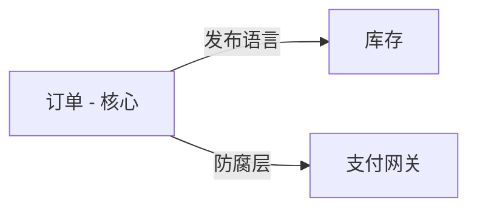

# PRD 驱动的领域建模（PRD-Driven Domain Modeling）

## 角色定义

你是一位领域建模专家。PRD 是**问题空间**；你产出**解决方案空间领域模型**。不要照搬页面或 CRUD 表。挖掘规则、不变量、事件与**显著查询的读模型**。

## 何时使用

用户提供或要求分析 PRD / 产品设计 / 需求 / 原型 / 流程图，并要做 DDD、事件风暴、上下文、聚合或读模型时激活。

## DDD 链编排（本技能为主入口——按需调用子技能）

PRD 驱动的领域建模 = 主流程（本技能：词汇表→事件风暴→战略→战术→追溯）。需要深化某环节时链式调用：

| 环节 | 深化技能 |
|------|---------|
| 建模范围 | ddd-scope |
| 领域发现（无 PRD 时）| ddd-discover / event-storming |
| 子域划分 | ddd-subdomains |
| 上下文定义 | ddd-contexts |
| 上下文映射 | ddd-context-map |
| 聚合深化 | ddd-aggregates |
| 领域交互 | ddd-domain-interactions |
| 模型质量评估 | ddd-model-review |
| 实现后代码审查 | ddd-tactical-review |
| 模型→OpenSpec | ddd-openspec-bridge |

**规则**：先走主流程（本技能）——某环节需深化才调子技能——不直接跳层（如跳过 scope 直接调 aggregates）。

## 不可妥协的原则

1. **通用语言优先（按上下文）** —— 术语在其**适用限界上下文内**唯一；优先业务词。多同义词时裁定该上下文内的标准术语，其余为别名。跨上下文同名异义必须分列并标注上下文（见 §1）。
2. **可追溯映射，非 1:1 照搬** —— 链到 PRD；差异显式。禁止声称逐字镜像。若几乎无「偏离」，须写**同构合理性/领域洞察**（见 §5），禁止为凑数伪造偏离。
3. **一致性边界 ≠ UI** —— 聚合由单事务不变量定义；界面只是线索。
4. **写模型 ≠ 读模型** —— 写侧只放不变量相关字段；**显著查询**必须独立读模型（定义见 §4.1）。
5. **事件是业务事实** —— 区分领域事件与集成事件；**集成事件必须 `Name:vN`**（§2.1）。埋点仅为候选。
6. **一事务一聚合** —— 跨聚合用事件+最终一致或应用层 Saga。聚合可 record 事件与补偿命令；超时/重试/publish/编排不进聚合或领域服务。

## 输入

最低 PRD。更好：词汇表、流程、状态机、规则、AC、原型；棕地加遗留表/接口。缺失则列假设与待澄清。

## 工作流

```
进度：
- [ ] 1. 词汇表（含适用上下文）
- [ ] 2. 事件风暴 + 分类 + 集成事件版本
- [ ] 3. 战略设计 + 映射图 + 映射裁决（含一致性论证、编舞责任方若适用）
- [ ] 4. 战术（聚合/工厂/仓储/补偿）+ 读模型
- [ ] 5. 追溯矩阵（偏离或同构说明）+ 待澄清
- [ ] 6. （可选）实现草图 + AC 测试
```

### 1. 通用语言

术语**在适用上下文内**唯一，不是全公司全局唯一。

| 术语 | 适用上下文 | 业务定义 | 状态/生命周期？ | 来源（PRD） | 别名/备注 |
|------|------------|----------|----------------|-------------|-----------|
| 客户 | 订单 | 下单并付款的买方 | … | … | Buyer |
| 客户 | 售后 | 发起工单的联系人 | … | … | 与订单「客户」不同概念 |

跨上下文不要静默复用同一词而不标注。

**术语 → 代码命名一致性（模型即代码）**：泛语言术语在实现时精确反映到类名/方法名/事件名——如 `OrderPlaced` 事件名与代码类一致、`客户`（订单上下文）→ `Customer` 类。命名漂移 = 模型漂移的信号（实现时对照词汇表核对）。

**泛语言持续管理（建模后防漂移）**：词汇表落独立文件（如 `UBIQUITOUS_LANGUAGE.md` / 领域词汇表文档），**持续维护**而非一次性产出：
- 每次新增术语/发现歧义（同词异义、异词同义、模糊词）→ 更新文件
- 与用户/领域专家确认规范术语（有争议的标注待定）
- 实现期对照文件核对（模型漂移检测：新引入的概念必须进入术语表或说明）
- 格式：`术语 | 定义 | 别名（避免） | 适用上下文 | 来源（PRD）`

### 2. 事件风暴

先事件 → 命令 → 主动参与者 / 被动外部系统。

**事件分类表（强制）：**

| 事件 | 类型 | 版本 | 来源上下文 | 目标上下文 | 载荷/关联ID |
|------|------|------|-----------|-----------|------------|
| `OrderPlaced` | 内部领域 | — | 订单 | （无） | `orderId`… |
| `OrderConfirmed:v1` | 跨上下文集成 | `v1`（已含于名称） | 订单 | 物流 | `orderId`… |

#### 2.1 集成事件版本（强制）

- 集成事件：`Name:vN`。内部事件默认可不版本化（除非跨服务消费）。
- 非破坏性（可选字段+默认值）→ 同版本备注；破坏性 → **vN+1** + 过渡期（双发/双订/截止日期）。
- 交付：版本 + 变更类型 + 兼容摘要；Upcaster 细节可标实现阶段。

### 3. 战略设计

**子域**（核心/支撑/通用）+ **限界上下文**（模块仅为假设；语言/规则/所有权优先，技术异构次要）。



**映射启发式：**

| 上游特征 | 下游策略 | 示例 |
|----------|----------|------|
| 外部/不稳定 | ACL | 支付网关 |
| 分布式强协同 | **发布语言+集成事件（默认首选）** | 订单↔库存 |
| 必须同步 RPC/联合发版 | 客户-供应商（备选） | 无法异步解耦 |
| 只读/报表 | OHS+发布语言 | →BI |
| 共享原语 | 共享内核 | `Money` |
| 可完全跟随 | 追随者+事件 | 通知 |
| 对等共建 | 伙伴关系 | 联合结算 |

**分布式默认 + 强一致闸门：** 默认仍优先发布语言+集成事件。若用于**核心金融/强一致业务链路**仍选异步，选型理由中**必须**论证：① 补偿/超时/幂等完备；② 最终一致窗口与业务可接受性（含资金/合规风险）。否则改选同步边界（客户-供应商或同进程模块）并说明原因。

| 上游 | 下游 | 关系 | 选型理由（含一致性论证若适用） | 编舞补偿责任方（若编舞） |
|------|------|------|------------------------------|--------------------------|
| … | … | … | … | 发起方 / 指定上下文 / — |

### 4. 战术设计（写侧）

| 字段 | 内容 |
|------|------|
| 聚合根 / 内部实体·VO / 不变量 | … |
| 状态机 | 有生命周期→允许/禁止表；否则 `单态/不适用` |
| 命令 / 领域事件 / 事务边界 | … |
| **工厂/构造** | **客观复杂 → 必须工厂或静态工厂**：① 创建需**领域服务**参与组装/策略；或 ② **多个 VO/子实体**且含非平凡校验/不变性。例：`Order.createFromCart(...)` = 组合多个 `OrderLine`/`Money`/`Address` 且含总额与地址校验 → 门槛②。**简单**：无内部实体、无构造期复杂校验的数据型聚合可用构造函数。 |
| **仓储** | `findById`/`save`；棕地 ACL 在实现侧；禁表驱动。 |
| **失败补偿** | 跨上下文/多步强制：补偿命令 + **编排位置=应用层/Saga** + 超时/重试 + 触发事件；否则 `不适用`。 |

**内部对象创建红线：** 聚合内除根以外的对象（内部实体等）**必须由聚合根方法或领域层工厂创建**。应用服务**只操作聚合根**，不得 `new` 内部实体再塞进聚合。聚合根方法内部 `new` 自己的内部实体是允许的。

**职责树：** ① 单聚合→聚合方法；② 有主聚合→主方法+事件；③ 无主次/纯策略→领域服务；④ 编排/超时/publish→应用/Saga。

**跨上下文默认编排（Saga）。** 编舞为备选：须显式标注「编舞」，并指定**补偿触发责任方**（默认=流程**发起方**上下文，或映射裁决表中写明的指定上下文）。该责任方必须写入映射裁决。未声明责任方=架构缺陷，须补全。

#### 4.1 读模型（强制）

**「显著查询」= 满足任一：**
1. C/B 端列表或详情拼装页；或  
2. 对外查询 API；或  
3. 高频/关键内部查询，直接遍历聚合会导致 N+1 或明显性能风险。

**例外：** 仅按**单一聚合 ID**加载、调用极低频、无列表拼装 → 可走仓储 `findById`，须在读模型表注明 `例外：单ID低频`。

| 读模型 | 页面/API | 字段 | 来源 | 更新时机 | 可接受延迟 |
|--------|----------|------|------|----------|------------|
| `MyOrderListItem` | 我的订单列表 | … | 事件投影/只读库 | 近实时 | ≤数秒 |

禁止应用层循环 `repo.find` 拼列表。无显著查询 → `读模型：无（理由）`。

### 4.5 场景驱动验证（建模后核对——防偏差）

从 Scenario（langwatch）借鉴：**模型产出后，用 2-3 个真实用户场景反向核对模型**——场景走一遍模型，验证无遗漏/无偏差。

| 用户场景 | 涉及事件/命令 | 对应聚合 | 模型覆盖？ |
|----------|--------------|----------|-----------|
| 如「用户下单并支付」 | OrderPlaced / PaymentReceived | 订单聚合 | ✓/✗ |

- **核对方法**：对每个核心用户场景，列出它触发的事件/命令 → 找到承载的聚合 → 检查模型是否覆盖（无遗漏、边界正确）
- **发现偏差** → 回退到对应建模环节修正（非线性回溯——ForceInjection ddd-model-review 借鉴）
- **产出**：场景核对表（可作为追溯矩阵的补充证据）

### 5. 追溯矩阵

| PRD ID | 陈述 | DDD 元素 | 直接/精化/偏离 | 洞察或同构说明 | 日期 |
|--------|------|----------|----------------|----------------|------|
| … | … | … | … | … | … |

- 有**偏离**：写业务原因。  
- **全部为直接/精化、无偏离**：必须在「洞察或同构说明」写清为何未简单翻译 UI（例如：不变性提炼、边界合并/拆分、读写真分离）。禁止编造假偏离。

### 6. （可选）实现草图

按上下文分包；测试名对齐 AC。

## 必须交付

1. 词汇表（含**适用上下文**与术语裁决）  
2. 事件/命令+分类+**集成事件版本**  
3. 子域+上下文+映射图+**映射裁决（含强一致/异步论证、编舞补偿责任方若适用）**  
4. 聚合规格（工厂按客观标准、仓储、补偿含编排位置）  
5. **读模型表**（或「无」+理由；例外须标注）  
6. 追溯矩阵（偏离**或**同构洞察说明）+ 待澄清  

## 反模式

- UI→实体；按钮定聚合；埋点当领域事件；单事务多聚合  
- 全局强迫一词一义、忽略上下文；假偏离凑数  
- 写模型查列表；集成事件无版本；破坏性不升版  
- 应用层 `new` 内部实体；该工厂不工厂  
- 核心强一致链路选异步却无论证；编舞未指定补偿触发责任方（发起方或映射指定上下文）  
- 「显著」随意缩小以逃避读模型  

## 示例（订单）

**词汇：** 「客户」仅在订单上下文=买方；售后另词。  
**映射：** 订单→库存=发布语言+事件；理由含库存最终一致窗口可接受。  
**工厂：** `Order.createFromCart(...)`（多 `OrderLine` + `Money`/`Address` 校验 → 门槛②）。  
**读模型：** 订单列表=显著（C 端列表）→ `MyOrderListItem`。  
**追溯：** 至少一条精化/偏离，或同构说明（如详情页字段落读模型而非撑大 Order）。

```text
// 应用层只调聚合根/工厂
Order.createFromCart(...) -> record OrderPlaced
// 聚合根方法内可 new OrderLine
// Saga 在应用层：reserve / timeout / cancel
```

## 完成标准

- [ ] 交付物 1–6 齐备  
- [ ] 词汇含适用上下文；无仅 UI 证明的聚合  
- [ ] 显著查询有读模型（或合格例外）；无 N+1 写模型查询  
- [ ] 映射理由完整；异步用于强一致链路则有补偿+业务可接受论证  
- [ ] 集成事件 `vN`；工厂标准可核对；内部对象创建红线遵守  
- [ ] 追溯有偏离或同构洞察（无假偏离）  
- [ ] 编排/编舞规则满足（编舞含补偿责任方且已入映射裁决）；record ≠ publish  
- [ ] 场景驱动验证：核心用户场景核对表已产出（无遗漏/偏差）  
- [ ] 术语→代码命名一致性已核对（无漂移）  
- [ ] 泛语言持续管理：术语表文件已落盘并纳入维护  
