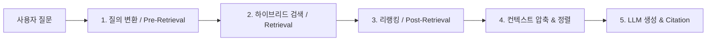

# Advanced RAG Search Optimizer Skill

이 스킬은 RAG(검색 증강 생성) 시스템에서 검색 정확도, 관련성(Precision/Recall), 답변 품질을 극대화하기 위한 아키텍처 설계와 구현 가이드라인을 제공합니다.

---

## 1. 검색 파이프라인 5단계 최적화 원칙



### [Step 1] 질의 전처리 & 변환 (Query Transformation)
* **HyDE (Hypothetical Document Embeddings)**: 사용자 질문에 대해 가상의 답변을 먼저 LLM으로 생성한 뒤, 그 가상 답변을 임베딩하여 검색.
* **Multi-Query Expansion**: 질문을 3~5개의 다양한 관점(동의어, 하위 질문)으로 분기하여 병렬 검색 후 합집합 생성.
* **Contextual Query Rewriting**: 이전 대화 맥락이 있는 경우, 대명사/생략된 주어를 복원한 완전한 독립 질의(Standalone Query)로 재작성.

### [Step 2] 인덱싱 & 청킹 전략 (Chunking & Indexing)
* **Contextual Retrieval (맥락 주입 청킹)**:
  * 각 청크 맨 앞에 `[문서 요약 / 섹션 경로 / 문서 제목]` 메타데이터 맥락을 50~100토큰 내외로 프리픽스 주입 후 임베딩.
* **Parent-Child (Hierarchical) Chunking**:
  * 검색은 작은 청크(Small Chunk, 100~200토큰)로 정밀하게 수행하고, LLM에 전달할 때는 상위 부모 청크(Large Chunk, 500~1000토큰)를 전달.
* **Semantic / Sentence-Window Chunking**:
  * 고정 글자수 단위가 아닌 문장/문단 단위 경계를 보존하고 슬라이딩 윈도우 오버랩(15~20%) 적용.

### [Step 3] 하이브리드 검색 (Hybrid Retrieval)
* **Dense + Sparse 결합**:
  * Dense (Vector Embedding: 예: text-embedding-3, BGE-m3 등) + Sparse (BM25 키워드 검색)
* **RRF (Reciprocal Rank Fusion)** 점수 결합:
  $$RRF\_Score(d) = \sum_{m \in M} \frac{1}{k + rank_m(d)} \quad (k=60)$$

### [Step 4] 사후 처리 및 리랭킹 (Reranking)
* **Cross-Encoder Re-ranker 필수 적용**:
  * 1차 검색에서 Top-K(예: 30~50개)를 넓게 가져온 뒤, Cohere Rerank / BGE-Reranker-v2 / FlashRank 등을 통해 최종 Top-N(예: 3~5개)으로 압축.
* **Lost in the Middle 방지**:
  * 가장 중요도/유사도가 높은 문서를 프롬프트의 **맨 앞**과 **맨 뒤**에 배치.

### [Step 5] 환각 방지 및 평가 (Guardrails & Evaluation)
* **Source Citation 강제**: 답변 시 반드시 인용한 청크 ID 또는 문서 출처를 각 문장에 명시하도록 프롬프트 구성.
* **RAGAS 프레임워크 기반 평가 지표**:
  * `Faithfulness` (충실도: 생성된 답변이 제공된 문서 내용에만 기반하는가)
  * `Answer Relevance` (답변 관련성: 사용자 질문 의도에 부합하는가)
  * `Context Precision` (문맥 정밀도: 검색된 청크 중 실제 필요한 정보 비율)
  * `Context Recall` (문맥 재현율: 정답에 필요한 모든 정보가 검색되었는가)

---

## 2. 권장 코드 구현 패턴 (Python / C#)

### Python (LangChain / LlamaIndex / Custom)
```python
# 하이브리드 검색 + Cross-Encoder 리랭킹 파이프라인
from sentence_transformers import CrossEncoder

def hybrid_rerank_pipeline(query: str, vector_store, bm25_retriever, top_k=50, top_n=5):
    # 1. 1차 병렬 검색 (Dense + Sparse)
    dense_docs = vector_store.similarity_search(query, k=top_k)
    sparse_docs = bm25_retriever.get_relevant_documents(query, k=top_k)
    
    # 2. 중복 제거
    unique_docs = {doc.metadata['id']: doc for doc in dense_docs + sparse_docs}.values()
    
    # 3. Cross-Encoder 리랭킹
    reranker = CrossEncoder("BAAI/bge-reranker-v2-m3")
    pairs = [[query, doc.page_content] for doc in unique_docs]
    scores = reranker.predict(pairs)
    
    # 4. 점수 정렬 및 상위 Top-N 추출
    scored_docs = sorted(zip(unique_docs, scores), key=lambda x: x[1], reverse=True)
    return [doc for doc, score in scored_docs[:top_n]]
```

---

## 3. 체크리스트: RAG 품질이 낮을 때 점검 사항
1. [ ] **검색 단계 문제인가, LLM 생성 단계 문제인가?**
   * (검색된 Top-K 청크 안에 실제 정답 데이터가 포함되어 있는지 로그 확인)
2. [ ] **특정 고유명사나 모델명, 에러 코드가 무시되는가?**
   * $\rightarrow$ Vector 전용 검색에서 BM25/Elasticsearch 하이브리드 검색으로 전환.
3. [ ] **청크 크기가 너무 크거나 잘려 맥락이 손실되었는가?**
   * $\rightarrow$ Parent-Child Chunking 또는 Contextual Retrieval 적용.
4. [ ] **관련 없는 청크가 섞여 LLM이 혼란을 겪는가?**
   * $\rightarrow$ Cross-Encoder Reranker 적용 및 Top-K 압축.
